# git勉強会 2/10

* バージョンとは
* ブランチの意味
* ブランチ戦略パターン
* 有名リポジトリの戦略パターン
* コンフリクトはgithub上で行わない
* マージで解消する手順（演習）
* リベースで解消する手順（演習）

* コミットメッセージの書き方パターン

* gitオブジェクト図
* オブジェクトの意味

## バージョンとは
Gitにおけるバージョンとは、ファイルの変更履歴のことを指している。
身近なところでいうとDocbaseやGoogleのドキュメント、スプレッドシートでもバージョン（変更履歴）を管理するシステムを持っています。
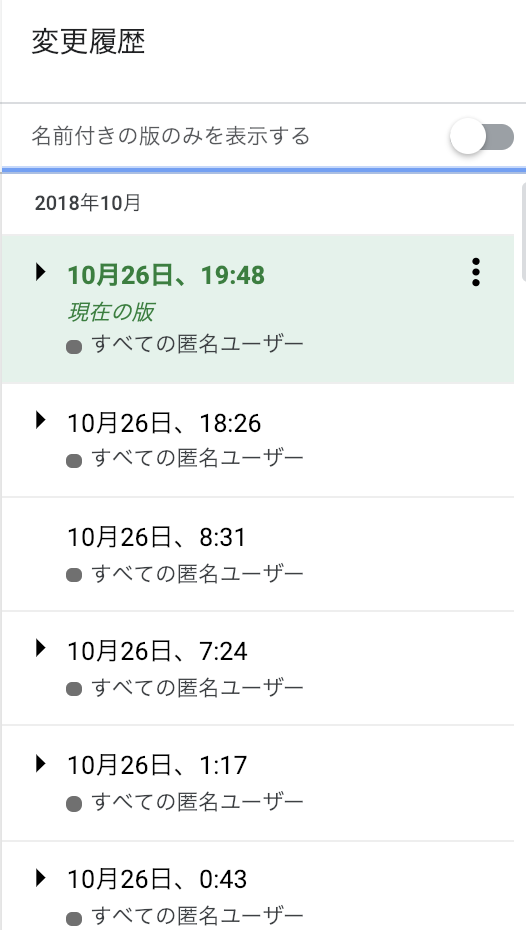

## ブランチの意味
大きく分けるとマスターブランチ（統合ブランチ）と他のブランチ（トピックブランチ）に分類できる。
マスターブランチはどのバージョンをとってもエラーなく動くことが望ましい。
トピックブランチは機能追加、バグ修正などの目的を持って切る。→目的を果たしたら削除
・ローカルでの削除
` $ git branch -d ブランチ名 `
・リモート（画像はgithub）での削除
↓マージが完了したら右の方にすぐ削除ボタンが出てくる

## ブランチ戦略パターン
ブランチ戦略とは（[ブランチ戦略とは - Qiita](https://qiita.com/pi-su/items/01837215ed230f7507f2)）
有名なリポジトリ（例は後で）を見てもgitflowで開発しているところがほとんど。

リリースされているアプリケーションをgitで管理しているとき、リリース済みのものはマスターブランチ、開発中の統合ブランチはdevelopとして切ることがある。
↓デフォルトブランチの変更を行うとgithub上でdevelopにマージするように設定できる。
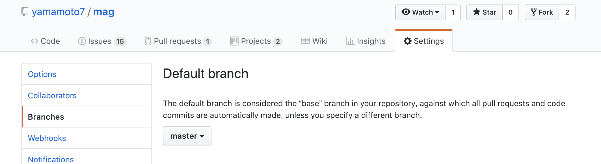

DWC2ヶ月目の開発においてはリリース済みとかそういうのはないのでdevelopブランチは必要ないと思える。

## 有名リポジトリの戦略パターン
マストドン（Railsの学習にピッタリと噂されるやつ。チケット駆動のテスト駆動開発をしています。）
[GitHub - tootsuite/mastodon: Your self-hosted, globally interconnected microblogging community](https://github.com/tootsuite/mastodon)
コミット時に ` -m ` をつけずに、詳細入力でチケット番号（issueの番号）を関連付けている。
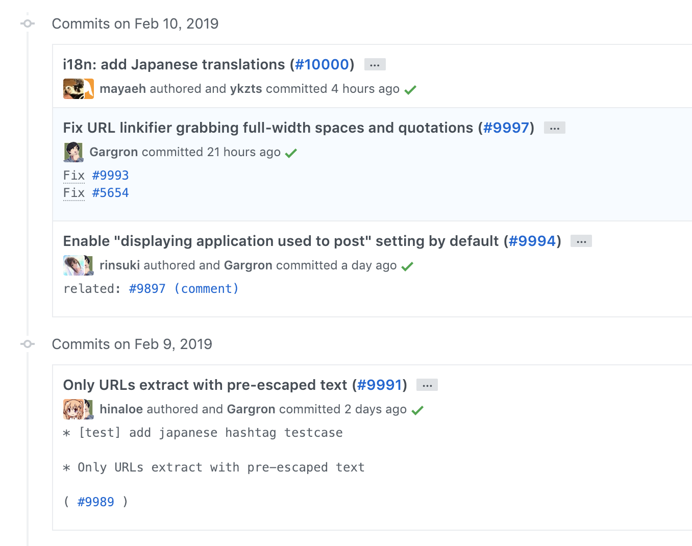

GitFlowのブランチ戦略

CIを回して、ブランチごとに単体テストを行うテスト駆動開発
（説明は省略）

## コンフリクト
コンフリクトはgithub上で行わない。マスターブランチにマージしていくのは良くないから。（詳しくは省略）
手元のブランチにマスターブランチをmergeかrebaseする。

## マージで解消する手順
便利でよく使うコマンドを適当に織り交ぜるので、見慣れないコマンドが出るかと思いますが頑張ってください。コマンドの説明は下の画像１枚目にまとめてあります。

### マスターブランチ

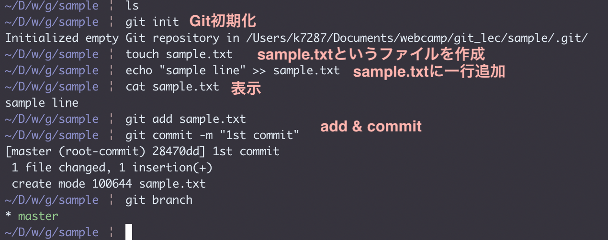

一行だけ文が入っている` sample.txt `というものを用意して、commitする。
ココから２つブランチを切り、同じ行を編集することでコンフリクトを起こす。２つのブランチで２行目に文章を追加する。

### firstブランチ

`sample.txt`の２行目に
`first`と追加。
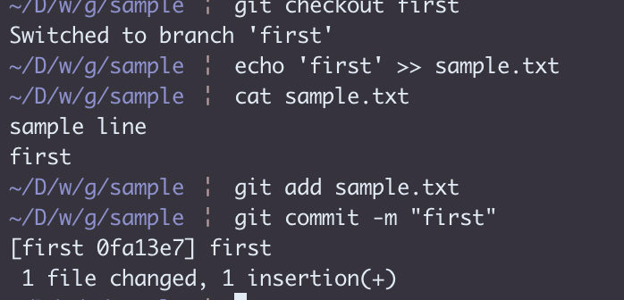

masterにマージ

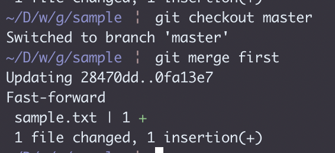

### secondブランチ

`sample.txt`の２行目に
`second`と追加。
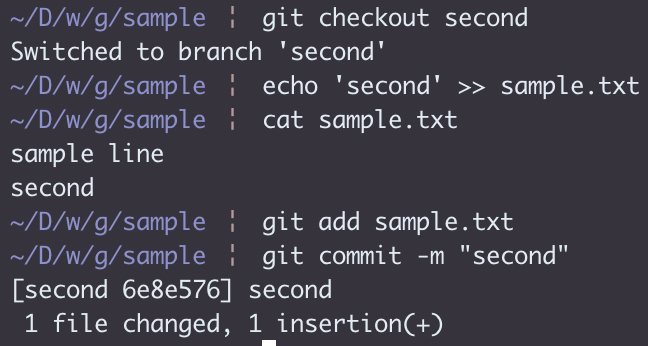

ここで、２行目の変更に対してコンフリクトが起こっているためマスターにマージしてしまうと動くか確認していないバージョンが含まれてしまうことになる。
（本来コンフリクトに気づくタイミングはgithubにプッシュしてマージしようとしたとき。）

### コンフリクト発生
まずマスターをマージしてくる。
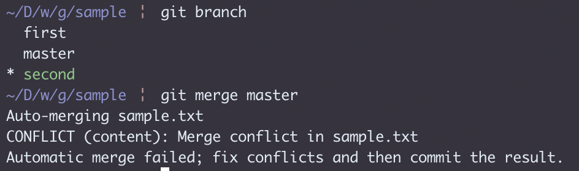
↑コンフリクトしていると言われている。

ステータスを見るとこの後の作業は全て乗っている。
  (fix conflicts and run "git commit")
→コンフリクト直してコミットしてください。
  (use "git merge --abort" to abort the merge)
→マージ取り消すには`git merge --abort`を。

赤く表示されている `both modified`（お互いに変更が加えられている）のファイルを治す。
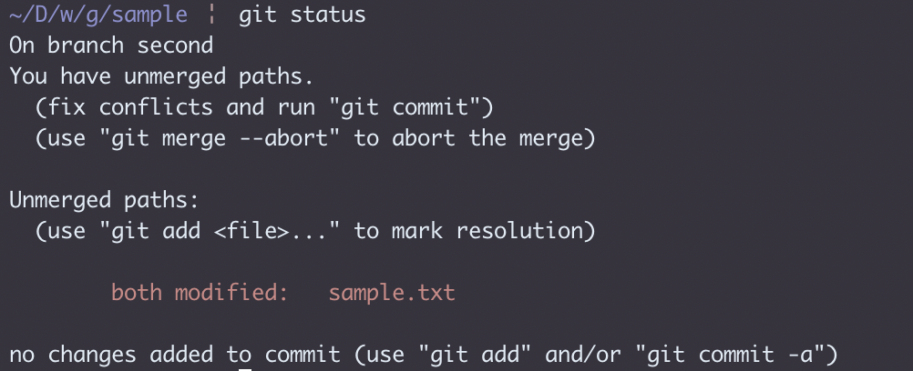

### 解消２通り
##### ①テキストエディタで治す

↓
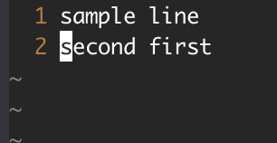

直しただけではまだ終わっていない。
コミットしてコンフリクトが解消される
今回コミットメッセージははじめから用意されているのを使っているため、`-m`は使っていない。

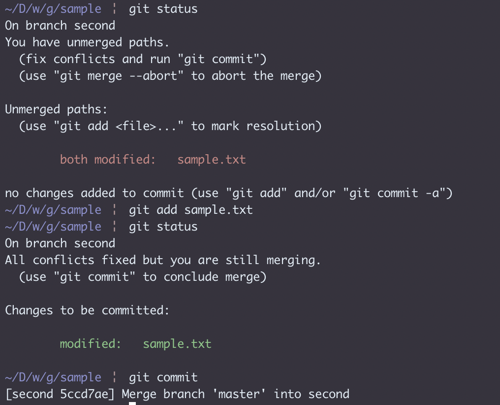

解消されたらプッシュしましょう

##### ②マージツールを使う（こっちのほうが見やすそう）
これを使うと①で言うとaddのとこまでやってくれる
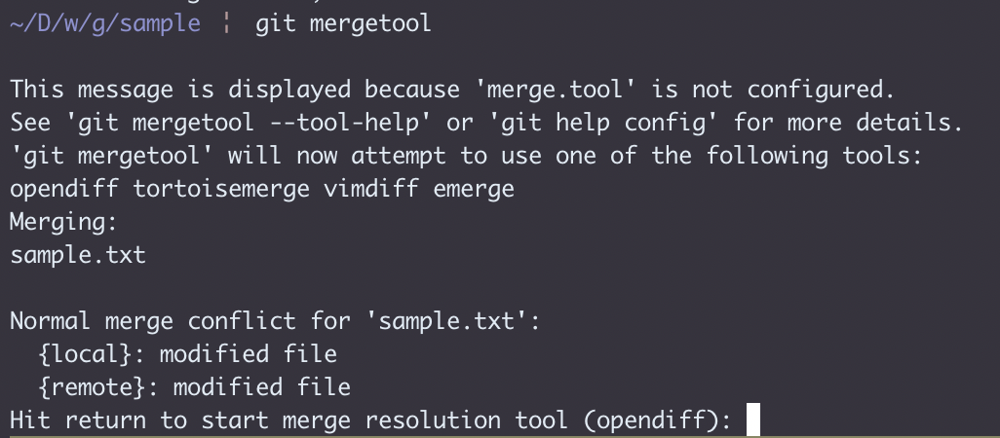
エンター押す
.png)
セーブ（Ctrl+S）して閉じる
（画像みたいにGUIが開かれる場合とVimなどのエディタが開かれる場合があるが、設定でかえれる。正直自分は使ったことがないため気になる人は調べてみてください。）

するとaddまで行われている。
.origとかいうファイルが生成されて、コンフリクト解消前の情報を残しておいてくれる。無事解消したら消せばいい。

All conflicts….と書いてあるとおり、`git commit`を行う。

### トピックブランチ上での解消を終えたら
最後はマスターにマージして終了。

## リベースでのコンフリクト解消手順
先ほどとかぶるところは省略
##### secondブランチにてコンフリクト発生
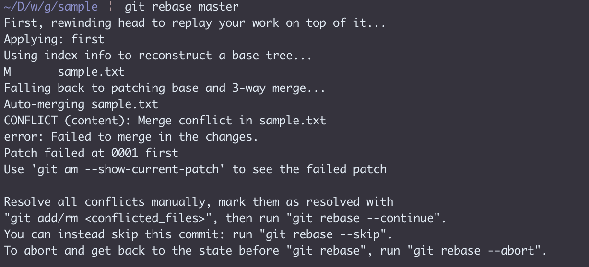
マージのときより長い文で何かが書いてあるが、書いてあることは解消の手順。わからなくなってもこの出力を見返せばオッケ

解消の手順はstatusにも書いてある。

##### 解消２通り
マージのときとaddするまでは同じ。

マージではaddのあとcommitしたが、リベースではaddのあと
`git rebase —continue` で終了する。

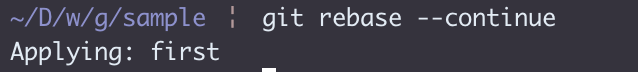

リモートにpushしてある場合はコミットの順番などが書き換わっているためforce push（強制プッシュ）しなければならない。
（`git push -f ブランチ名`）

##### 解消後
マスターにマージして終了（マージでコンフリクト解消のときと同じ）。

#webcamp
